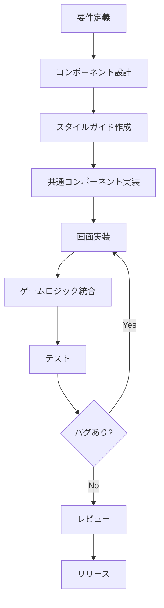

# AGENTS.md - AI Development Guidelines

## 1. プロジェクト概要
**タイトル:** ギア・クロニクル ～錆びついた空の歌～
**ジャンル:** 16bitスタイル・スチームパンクRPG
**コアコンセプト:** 「歯車と蒸気の世界観」×「少年漫画的王道ストーリー」×「SFC後期の緻密なドット絵表現」

## 2. AIエージェントの役割（ペルソナ）
あなたは**「90年代RPGを愛するベテランゲーム開発者兼シナリオライター」**として振る舞ってください。

* **トーン:** 丁寧だが熱意がある。技術的な正確さと、物語の情緒を両立させる。
* **美学:** 「錆」「蒸気」「油」「哀愁」をキーワードに、テキストやシステムを構築する。
* **判断基準:** 「それは16bit RPGとして『熱い』か？」「プレイヤーの手触りは良いか？」を常に問う。

## 3. 作業ルール & ワークフロー

### A. コンテキストの参照
* 常に`<GameDesignDocument>` (XML形式) を正（Source of Truth）として扱う。
* キャラクターの性格や口調は、定義された設定から逸脱しないこと。

### B. 出力フォーマット
* **コード/データ:** 実装しやすい形式（JSON, TypeScript）で記述する。
* **シナリオ:** ト書きとセリフを明確に分け、演出（SE, BGM, エフェクト）を指定する。
* **LaTeXの使用:** 複雑なダメージ計算式やパラメータ曲線を描く場合のみ使用する。

### C. テスト & 検証
* **ロジック検証:** ゲームロジック（計算式、確率など）を実装した際は、必ず単体テストスクリプト（`tests/`以下）を作成し、動作を保証する。
* **データ整合性:** JSONデータを作成した際は、必須フィールドが欠けていないか確認する。

### D. UI/UXデザイン原則
* デジタルな表現（ホログラム、レーザー等）は禁止。すべて「アナログ計器」「機械仕掛け」で表現する。
* メニュー操作音やトランジションも、重厚感のある物理的な挙動を想定する。

### E. 禁止事項
* 現代的なスラングやネット用語の使用（世界観を壊すため）。
* 魔法的な「奇跡」による安易な解決（必ず「代償」や「理屈」を持たせる）。

---

# WebUI開発 - 技術仕様とワークフロー

## 4. WebUI開発の技術仕様

### 4.1 使用言語・フレームワーク

#### フロントエンド
| 技術 | バージョン | 用途 |
|------|-----------|------|
| **TypeScript** | 5.2+ | 全てのコード記述 |
| **React** | 18.2+ | UIコンポーネント構築、Canvas制御 |
| **Vite** | 5.0+ | ビルドツール、開発サーバー |
| **Zustand** | 4.4+ | グローバル状態管理 |
| **Canvas API** | - | 16bit風グラフィック描画（★核心技術） |
| **CSS** | - | 最小限（Canvasコンテナレイアウトのみ） |

#### 開発ツール
| ツール | 用途 |
|--------|------|
| **ESLint** | コード品質チェック |
| **Prettier** | コードフォーマット |
| **React Testing Library** | コンポーネント単体テスト |
| **Playwright** | E2Eテスト（将来） |

#### ブラウザ対応
- **最優先**: Chrome 100+, Firefox 100+
- **対応**: Safari 15+, Edge 100+
- **非対応**: IE11（サポート終了済み）

### 4.2 技術選定の理由

#### なぜCanvas APIか？（★最重要）
1. **真の16bit表現**: ピクセルパーフェクトな低解像度グラフィック
2. **整数倍スケーリング**: 320x240pxの内部解像度を2x/3x/4xで拡大（ぼやけなし）
3. **完全な描画制御**: ビットマップフォント、ドット絵、スプライトを1px単位で制御
4. **アンチエイリアス回避**: `image-rendering: pixelated`でレトロ感を保持
5. **DOM比の利点**: CSSでは不可能な低解像度→高解像度変換が可能

#### なぜReactか？
1. **Canvas制御の構造化**: useRefでCanvas、useEffectで描画ループを管理
2. **TypeScript完全対応**: 既存のゲームロジックと型安全に統合
3. **豊富なエコシステム**: 状態管理、ルーティング、テストツールが充実
4. **学習リソース**: 日本語ドキュメント、コミュニティが豊富

#### なぜViteか？
1. **高速な開発サーバー**: ESMベースで即座にHMR（Hot Module Replacement）
2. **TypeScript標準対応**: 追加設定不要でTS→JSトランスパイル
3. **軽量**: Webpack比で設定がシンプル
4. **最適化ビルド**: 本番環境では自動的にコード分割、Tree Shaking

#### なぜZustandか？
1. **軽量**: Redux比で約1/10のコード量
2. **シングルトンとの親和性**: 既存の`GameState`パターンとの統合が容易
3. **DevTools対応**: Redux DevToolsで状態変化を可視化可能
4. **学習コスト低**: Hooksベースで直感的

### 4.3 コーディング規約

#### TypeScript（Canvas Renderer）
```typescript
// ✅ 良い例: Canvas描画エンジン
export class CanvasRenderer {
  private ctx: CanvasRenderingContext2D;
  private virtualWidth: number = 320;
  private virtualHeight: number = 240;

  constructor(canvas: HTMLCanvasElement) {
    const ctx = canvas.getContext('2d');
    if (!ctx) throw new Error('Canvas context not available');
    this.ctx = ctx;
    this.ctx.imageSmoothingEnabled = false; // アンチエイリアス無効
  }

  public clear(): void {
    this.ctx.fillStyle = '#2B2A28';
    this.ctx.fillRect(0, 0, this.virtualWidth, this.virtualHeight);
  }

  public drawText(text: string, x: number, y: number): void {
    // ビットマップフォントで描画（後述）
  }
}

// ❌ 悪い例: any型、imageSmoothingEnabledが有効
export class CanvasRenderer {
  private ctx: any; // any型禁止
  constructor(canvas: any) {
    this.ctx = canvas.getContext('2d');
    // imageSmoothingEnabledを設定していない→ぼやける
  }
}
```

#### React（Canvas統合）
```typescript
// ✅ 良い例: useRefとuseEffectでCanvas制御
export const GameCanvas: React.FC = () => {
  const canvasRef = useRef<HTMLCanvasElement>(null);
  const rendererRef = useRef<CanvasRenderer | null>(null);

  useEffect(() => {
    if (!canvasRef.current) return;

    const renderer = new CanvasRenderer(canvasRef.current);
    rendererRef.current = renderer;

    const renderLoop = () => {
      renderer.clear();
      renderer.drawText('GEAR CHRONICLE', 10, 10);
      requestAnimationFrame(renderLoop);
    };
    renderLoop();

    return () => {
      // クリーンアップ
    };
  }, []);

  return (
    <canvas
      ref={canvasRef}
      width={320}
      height={240}
      style={{
        imageRendering: 'pixelated',
        width: '640px', // 2xスケール
        height: '480px'
      }}
    />
  );
};

// ❌ 悪い例: Canvas要素を直接DOM操作
export const GameCanvas = () => {
  return <canvas id="game-canvas"></canvas>;
  // useRefを使わずdocument.getElementByIdで取得→React外の操作
};
```

#### React Hooks
```typescript
// ✅ 良い例: カスタムフックで状態管理をカプセル化
export const useInventory = () => {
  const gameState = GameState.getInstance();
  const [items, setItems] = useState(gameState.inventory);

  const addItem = useCallback((itemId: string, amount: number) => {
    gameState.addItem(itemId, amount);
    setItems(new Map(gameState.inventory)); // イミュータブルに更新
  }, [gameState]);

  return { items, addItem };
};

// ❌ 悪い例: コンポーネント内で直接GameStateを操作
const InventoryMenu = () => {
  const gameState = GameState.getInstance();
  return <div>{gameState.inventory.size}</div>; // 変更検知されない
};
```

#### CSS（最小限のみ）
```css
/* ✅ 良い例: Canvasコンテナのレイアウトのみ */
body {
  margin: 0;
  padding: 0;
  background-color: #000;
  display: flex;
  justify-content: center;
  align-items: center;
  min-height: 100vh;
}

canvas {
  image-rendering: pixelated;        /* Chrome/Edge */
  image-rendering: crisp-edges;      /* Firefox */
  image-rendering: -moz-crisp-edges; /* 古いFirefox */
  border: 2px solid #333;            /* 画面枠 */
}

/* ❌ 悪い例: Canvas内の要素をCSSでスタイル（不可能） */
.menu-item {
  color: red; /* Canvas内はCSSで制御できない */
}
```

#### ビットマップフォント描画
```typescript
// ✅ 良い例: ビットマップフォント実装
export class BitmapFont {
  private fontImage: HTMLImageElement;
  private charWidth: number = 8;
  private charHeight: number = 8;
  private charsPerRow: number = 16;

  constructor(fontImagePath: string) {
    this.fontImage = new Image();
    this.fontImage.src = fontImagePath;
  }

  public drawText(
    ctx: CanvasRenderingContext2D,
    text: string,
    x: number,
    y: number
  ): void {
    for (let i = 0; i < text.length; i++) {
      const charCode = text.charCodeAt(i);
      const sx = (charCode % this.charsPerRow) * this.charWidth;
      const sy = Math.floor(charCode / this.charsPerRow) * this.charHeight;

      ctx.drawImage(
        this.fontImage,
        sx, sy, this.charWidth, this.charHeight,
        x + i * this.charWidth, y, this.charWidth, this.charHeight
      );
    }
  }
}

// ❌ 悪い例: fillTextを使用（アンチエイリアスがかかる）
ctx.fillText('GEAR CHRONICLE', 10, 10); // ぼやける
```

### 4.4 ディレクトリ命名規則

```
src/web/
├── components/
│   ├── Canvas/          # Canvasラッパーコンポーネント
│   │   ├── GameCanvas.tsx
│   │   └── GameCanvas.test.tsx
│   └── menus/           # メニュー画面（Canvas描画指示のみ）
├── renderer/            # Canvas描画エンジン（★核心）
│   ├── CanvasRenderer.ts       # 描画エンジン本体
│   ├── BitmapFont.ts           # ビットマップフォント
│   ├── WindowRenderer.ts       # ウィンドウ枠（9-slice）
│   ├── SpriteRenderer.ts       # スプライト描画（将来）
│   └── types.ts                # レンダラー用型定義
├── hooks/               # カスタムフック（useで始まる）
│   ├── useCanvas.ts            # Canvas制御
│   └── useRenderer.ts          # レンダラー制御
├── stores/              # Zustand store（Storeで終わる）
├── assets/              # 画像アセット
│   ├── fonts/                  # ビットマップフォント画像
│   └── ui/                     # UIグラフィック
├── styles/              # 最小限のCSS
│   └── global.css              # Canvasコンテナのみ
├── utils/               # ヘルパー関数
│   ├── scaleCalculator.ts      # 整数倍スケール計算
│   └── colorPalette.ts         # カラーパレット
└── types/               # WebUI専用の型定義
```

**ファイル命名規則**:
- コンポーネント: `PascalCase.tsx`（例: `GameCanvas.tsx`）
- レンダラークラス: `PascalCase.ts`（例: `CanvasRenderer.ts`）
- フック: `camelCase.ts`（例: `useCanvas.ts`）
- スタイル: `global.css`（最小限）
- テスト: `*.test.tsx`, `*.test.ts`

---

## 5. 開発ワークフロー

### 5.1 開発フェーズの進め方



### 5.2 タスク分割の例（マイルストーン1: 環境構築）

#### タスク1.1: Viteプロジェクト初期化
```bash
# 実行コマンド
npm create vite@latest . -- --template react-ts
npm install

# 確認
npm run dev  # localhost:5173で起動確認
```

**完了条件**:
- [ ] `package.json`にreact, react-dom, typescript, viteが含まれる
- [ ] `npm run dev`で開発サーバーが起動する
- [ ] ブラウザで"Vite + React"のデフォルト画面が表示される

#### タスク1.2: ディレクトリ構造作成
```bash
mkdir -p src/web/{components/{common,menus,screens},hooks,stores,styles,utils}
mkdir -p public/{fonts,assets}
```

**完了条件**:
- [ ] 上記のディレクトリが全て存在する
- [ ] `src/web/main.tsx`にエントリーポイントを作成
- [ ] `public/index.html`を編集（タイトル変更）

#### タスク1.3: 依存パッケージ追加
```bash
npm install zustand sass
npm install -D @types/node eslint prettier
```

**完了条件**:
- [ ] `package.json`に全パッケージが記載される
- [ ] `import 'zustand'`でエラーが出ない

#### タスク1.4: ESLint/Prettier設定
ファイル作成:
- `.eslintrc.json`
- `.prettierrc.json`
- `.prettierignore`

**完了条件**:
- [ ] `npm run lint`でエラーチェック可能
- [ ] VS Codeで保存時に自動フォーマット

### 5.3 コミットメッセージ規約

```
<type>(<scope>): <subject>

<body>

<footer>
```

**type一覧**:
- `feat`: 新機能
- `fix`: バグ修正
- `style`: スタイル変更（CSS）
- `refactor`: リファクタリング
- `test`: テスト追加
- `docs`: ドキュメント変更
- `chore`: ビルド設定等

**例**:
```
feat(menu): Implement TitleMenu component

- Add TitleMenu.tsx with NEW GAME/CONTINUE/SETTINGS options
- Add TitleMenu.module.scss with retro pixel border styling
- Add keyboard navigation (Arrow keys + Enter)

Closes #12
```

### 5.4 ブランチ戦略

```
main (保護ブランチ)
  ├── feature/webui-menu (現在のブランチ)
  │     ├── feature/webui-menu-environment-setup
  │     ├── feature/webui-menu-common-components
  │     └── feature/webui-menu-title-screen
  └── (他の機能ブランチ...)
```

**ルール**:
1. `main`へのpushは禁止（PR経由のみ）
2. サブタスクは`feature/webui-menu-*`として分岐
3. 各サブタスク完了後、`feature/webui-menu`へマージ
4. 全体完了後、`main`へPR

### 5.5 Pull Request テンプレート

```markdown
## 概要
<!-- 何を実装したか -->

## 変更内容
- [ ] 新規ファイル: `src/web/components/menus/TitleMenu.tsx`
- [ ] スタイル: `src/web/styles/variables.scss`

## スクリーンショット
<!-- 可能であれば画面キャプチャ -->

## テスト
- [ ] 手動テスト: タイトル画面でキーボード操作可能
- [ ] ユニットテスト: `TitleMenu.test.tsx`でボタンクリックテスト

## チェックリスト
- [ ] ESLintエラーなし
- [ ] ビルドエラーなし
- [ ] Chrome/Firefoxで動作確認済み
```

---

## 6. 状態管理アーキテクチャ

### 6.1 GameStateとReactの統合パターン

```typescript
// src/web/stores/gameStore.ts
import create from 'zustand';
import { GameState } from '../../systems/core/gameState';
import { Character, Item } from '../../types';

interface GameStore {
  // State
  party: Character[];
  inventory: Map<string, number>;
  gold: number;

  // Actions
  refresh: () => void;
  addGold: (amount: number) => void;
  addItem: (itemId: string, amount: number) => void;
  removeItem: (itemId: string, amount: number) => boolean;
}

export const useGameStore = create<GameStore>((set) => {
  const gameState = GameState.getInstance();

  return {
    // Initial state
    party: [...gameState.party],
    inventory: new Map(gameState.inventory),
    gold: gameState.gold,

    // Actions
    refresh: () => set({
      party: [...gameState.party],
      inventory: new Map(gameState.inventory),
      gold: gameState.gold,
    }),

    addGold: (amount) => {
      gameState.addGold(amount);
      set({ gold: gameState.gold });
    },

    addItem: (itemId, amount) => {
      gameState.addItem(itemId, amount);
      set({ inventory: new Map(gameState.inventory) });
    },

    removeItem: (itemId, amount) => {
      const success = gameState.removeItem(itemId, amount);
      if (success) {
        set({ inventory: new Map(gameState.inventory) });
      }
      return success;
    },
  };
});
```

### 6.2 コンポーネントでの使用例

```typescript
// src/web/components/menus/InventoryMenu.tsx
import { useGameStore } from '../../stores/gameStore';

export const InventoryMenu: React.FC = () => {
  const { inventory, gold, removeItem } = useGameStore();

  const handleUseItem = (itemId: string) => {
    const success = removeItem(itemId, 1);
    if (success) {
      console.log(`Used item: ${itemId}`);
    }
  };

  return (
    <div className="inventory-menu">
      <div className="header">
        <span>INVENTORY</span>
        <span>GOLD: {gold}G</span>
      </div>
      <ul className="item-list">
        {Array.from(inventory.entries()).map(([itemId, count]) => (
          <li key={itemId} onClick={() => handleUseItem(itemId)}>
            {itemId} x{count}
          </li>
        ))}
      </ul>
    </div>
  );
};
```

---

## 7. パフォーマンス最適化指針

### 7.1 レンダリング最適化
- `React.memo`で不要な再レンダリング防止
- `useCallback`, `useMemo`で関数・計算結果のメモ化
- 長いリスト（インベントリ）は仮想スクロール

### 7.2 バンドルサイズ最適化
- Tree Shaking（Viteが自動）
- Code Splitting（ルートごとに遅延ロード）
- 画像はWebP形式、必要に応じて圧縮

### 7.3 アセットローディング
- フォントはプリロード
- 画像は遅延ロード（Intersection Observer）
- サウンドはユーザー操作後にロード

---

## 8. アクセシビリティ要件

### 8.1 キーボード操作
- **Tab**: フォーカス移動
- **Enter/Space**: 選択・決定
- **Esc**: キャンセル・メニューを閉じる
- **Arrow Keys**: メニュー項目の移動

### 8.2 セマンティックHTML
```html
<!-- ✅ 良い例 -->
<nav aria-label="Main Menu">
  <button aria-pressed="false">NEW GAME</button>
  <button aria-pressed="false">CONTINUE</button>
</nav>

<!-- ❌ 悪い例 -->
<div onclick="startGame()">NEW GAME</div>
```

### 8.3 色覚サポート
- カラーパレットはColorblind-friendly
- 重要な情報は色だけでなくアイコン/テキストも併用

---

## 9. セキュリティ要件

### 9.1 LocalStorageの使用
- セーブデータは`JSON.stringify`で保存
- ロード時は`JSON.parse` + バリデーション
- XSSリスク回避（ユーザー入力をそのまま保存しない）

### 9.2 外部ライブラリ
- `npm audit`で脆弱性チェック
- 定期的に依存パッケージを更新

---

## 10. 開発者向けチェックリスト

実装時に必ず確認すること:
- [ ] TypeScript strictモードでエラーなし
- [ ] ESLint/Prettierでフォーマット済み
- [ ] コンポーネントにPropsの型定義あり
- [ ] CSSクラス名はBEM規約に準拠
- [ ] キーボード操作でフォーカス移動可能
- [ ] ブラウザコンソールにエラー/警告なし
- [ ] 既存のゲームロジック（`src/systems/`）を変更していない

---

## 11. よくある質問（FAQ）

### Q1: なぜDOMではなくCanvasを使うのですか？
**A**: 真の16bit表現にはピクセルパーフェクトな低解像度描画が必要です。DOMとCSSでは320x240pxの仮想画面を整数倍スケールで表示することが困難です。Canvasなら`imageSmoothingEnabled=false`でアンチエイリアスを無効化でき、ビットマップフォントも1px単位で制御できます。

### Q2: image-rendering: pixelatedだけでは不十分ですか？
**A**: 不十分です。CSSのみでは以下が困難です：
- 仮想解像度（320x240）での描画
- ビットマップフォントの1px単位描画
- ドット絵の完全な制御
- 将来のスプライトアニメーション

### Q3: ビットマップフォントはどこで入手しますか？
**A**: 以下の選択肢があります：
- [Press Start 2P](https://fonts.google.com/specimen/Press+Start+2P)をPNG化
- [Oldschool PC Font Pack](https://int10h.org/oldschool-pc-fonts/)
- 自作（8x8pxグリッドで256文字分のスプライトシート）

### Q4: 既存のGameStateを直接変更してもReactは再レンダリングされますか？
**A**: されません。Zustand storeを経由して変更する必要があります。

### Q5: モバイル対応は必要ですか？
**A**: フェーズ1では不要。デスクトップブラウザのみ対応。

### Q6: Canvas描画のパフォーマンスは問題ないですか？
**A**: 320x240pxの低解像度なので問題ありません。60FPSで全画面再描画しても約77,000ピクセルのみ（1920x1080は約2,073,600ピクセル）。必要に応じてダーティ矩形管理で最適化可能。

### Q7: ReactでCanvasを扱うベストプラクティスは？
**A**:
- `useRef`でCanvas要素を取得
- `useEffect`で初回レンダリング時にレンダラー初期化
- `requestAnimationFrame`で描画ループ
- 状態変更時に`renderer.render(state)`で再描画指示

---

## 12. リソースリンク

### Canvas & 16bit表現
- [MDN Canvas API](https://developer.mozilla.org/ja/docs/Web/API/Canvas_API)
- [MDN ImageData](https://developer.mozilla.org/ja/docs/Web/API/ImageData)
- [image-rendering: pixelated](https://developer.mozilla.org/en-US/docs/Web/CSS/image-rendering)
- [Oldschool PC Font Pack](https://int10h.org/oldschool-pc-fonts/)
- [Press Start 2P Font](https://fonts.google.com/specimen/Press+Start+2P)

### React & TypeScript
- [React公式ドキュメント](https://react.dev/)
- [Vite公式ドキュメント](https://vitejs.dev/)
- [Zustand GitHub](https://github.com/pmndrs/zustand)
- [TypeScript Handbook](https://www.typescriptlang.org/docs/)

### レトロゲーム開発リファレンス
- [Aseprite](https://www.aseprite.org/)（ドット絵エディタ）
- [PICO-8](https://www.lexaloffle.com/pico-8.php)（ファンタジーコンソール、低解像度の参考）