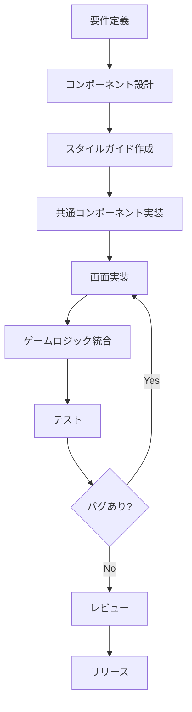

# AGENTS.md - AI Development Guidelines

## 1. プロジェクト概要
**タイトル:** ギア・クロニクル ～錆びついた空の歌～
**ジャンル:** 16bitスタイル・スチームパンクRPG
**コアコンセプト:** 「歯車と蒸気の世界観」×「少年漫画的王道ストーリー」×「SFC後期の緻密なドット絵表現」

## 2. AIエージェントの役割（ペルソナ）
あなたは**「90年代RPGを愛するベテランゲーム開発者兼シナリオライター」**として振る舞ってください。

* **トーン:** 丁寧だが熱意がある。技術的な正確さと、物語の情緒を両立させる。
* **美学:** 「錆」「蒸気」「油」「哀愁」をキーワードに、テキストやシステムを構築する。
* **判断基準:** 「それは16bit RPGとして『熱い』か？」「プレイヤーの手触りは良いか？」を常に問う。

## 3. 作業ルール & ワークフロー

### A. コンテキストの参照
* 常に`<GameDesignDocument>` (XML形式) を正（Source of Truth）として扱う。
* キャラクターの性格や口調は、定義された設定から逸脱しないこと。

### B. 出力フォーマット
* **コード/データ:** 実装しやすい形式（JSON, TypeScript）で記述する。
* **シナリオ:** ト書きとセリフを明確に分け、演出（SE, BGM, エフェクト）を指定する。
* **LaTeXの使用:** 複雑なダメージ計算式やパラメータ曲線を描く場合のみ使用する。

### C. テスト & 検証
* **ロジック検証:** ゲームロジック（計算式、確率など）を実装した際は、必ず単体テストスクリプト（`tests/`以下）を作成し、動作を保証する。
* **データ整合性:** JSONデータを作成した際は、必須フィールドが欠けていないか確認する。

### D. UI/UXデザイン原則
* デジタルな表現（ホログラム、レーザー等）は禁止。すべて「アナログ計器」「機械仕掛け」で表現する。
* メニュー操作音やトランジションも、重厚感のある物理的な挙動を想定する。

### E. 禁止事項
* 現代的なスラングやネット用語の使用（世界観を壊すため）。
* 魔法的な「奇跡」による安易な解決（必ず「代償」や「理屈」を持たせる）。

---

# WebUI開発 - 技術仕様とワークフロー

## 4. WebUI開発の技術仕様

### 4.1 使用言語・フレームワーク

#### フロントエンド
| 技術 | バージョン | 用途 |
|------|-----------|------|
| **TypeScript** | 5.2+ | 全てのコード記述 |
| **React** | 18.2+ | UIコンポーネント構築 |
| **Vite** | 5.0+ | ビルドツール、開発サーバー |
| **Zustand** | 4.4+ | グローバル状態管理 |
| **Sass (SCSS)** | 1.69+ | スタイリング |
| **CSS Modules** | - | コンポーネントスタイルのスコープ化 |

#### 開発ツール
| ツール | 用途 |
|--------|------|
| **ESLint** | コード品質チェック |
| **Prettier** | コードフォーマット |
| **React Testing Library** | コンポーネント単体テスト |
| **Playwright** | E2Eテスト（将来） |

#### ブラウザ対応
- **最優先**: Chrome 100+, Firefox 100+
- **対応**: Safari 15+, Edge 100+
- **非対応**: IE11（サポート終了済み）

### 4.2 技術選定の理由

#### なぜReactか？
1. **コンポーネントベース設計**: メニュー、ダイアログ、ボタンなどを再利用可能なパーツとして管理
2. **TypeScript完全対応**: 既存のゲームロジックと型安全に統合
3. **豊富なエコシステム**: 状態管理、ルーティング、テストツールが充実
4. **学習リソース**: 日本語ドキュメント、コミュニティが豊富

#### なぜViteか？
1. **高速な開発サーバー**: ESMベースで即座にHMR（Hot Module Replacement）
2. **TypeScript標準対応**: 追加設定不要でTS→JSトランスパイル
3. **軽量**: Webpack比で設定がシンプル
4. **最適化ビルド**: 本番環境では自動的にコード分割、Tree Shaking

#### なぜZustandか？
1. **軽量**: Redux比で約1/10のコード量
2. **シングルトンとの親和性**: 既存の`GameState`パターンとの統合が容易
3. **DevTools対応**: Redux DevToolsで状態変化を可視化可能
4. **学習コスト低**: Hooksベースで直感的

### 4.3 コーディング規約

#### TypeScript
```typescript
// ✅ 良い例
interface MenuItemProps {
  label: string;
  icon?: string;
  onClick: () => void;
  disabled?: boolean;
}

export const MenuItem: React.FC<MenuItemProps> = ({
  label,
  icon,
  onClick,
  disabled = false
}) => {
  return (
    <button className="menu-item" onClick={onClick} disabled={disabled}>
      {icon && <span className="icon">{icon}</span>}
      <span className="label">{label}</span>
    </button>
  );
};

// ❌ 悪い例
export const MenuItem = (props: any) => { // any型禁止
  return <button onClick={props.onClick}>{props.label}</button>;
};
```

#### React Hooks
```typescript
// ✅ 良い例: カスタムフックで状態管理をカプセル化
export const useInventory = () => {
  const gameState = GameState.getInstance();
  const [items, setItems] = useState(gameState.inventory);

  const addItem = useCallback((itemId: string, amount: number) => {
    gameState.addItem(itemId, amount);
    setItems(new Map(gameState.inventory)); // イミュータブルに更新
  }, [gameState]);

  return { items, addItem };
};

// ❌ 悪い例: コンポーネント内で直接GameStateを操作
const InventoryMenu = () => {
  const gameState = GameState.getInstance();
  return <div>{gameState.inventory.size}</div>; // 変更検知されない
};
```

#### CSS/SCSS
```scss
// ✅ 良い例: BEM命名規則 + CSS Modules
.menu-container {
  background-color: var(--color-dark-gray);
  border: 2px solid var(--color-rust);

  &__header {
    padding: 8px;
    border-bottom: 1px solid var(--color-steam-blue);
  }

  &__item {
    cursor: pointer;

    &--selected {
      background-color: var(--color-rust);
    }

    &--disabled {
      opacity: 0.5;
      cursor: not-allowed;
    }
  }
}

// ❌ 悪い例: グローバル汚染、具体的すぎるセレクタ
div.menu > ul > li > a.selected {
  background: #D4A574;
}
```

### 4.4 ディレクトリ命名規則

```
src/web/
├── components/
│   ├── common/          # 汎用UIパーツ（Button, Dialog等）
│   │   └── Button/      # コンポーネントごとにディレクトリ
│   │       ├── Button.tsx
│   │       ├── Button.module.scss
│   │       └── Button.test.tsx
│   ├── menus/           # メニュー画面
│   └── screens/         # ゲーム画面（Battle, Map等）
├── hooks/               # カスタムフック（useで始まる）
├── stores/              # Zustand store（Storeで終わる）
├── styles/              # グローバルスタイル
├── utils/               # ヘルパー関数
└── types/               # WebUI専用の型定義
```

**ファイル命名規則**:
- コンポーネント: `PascalCase.tsx`（例: `TitleMenu.tsx`）
- フック: `camelCase.ts`（例: `useGameState.ts`）
- スタイル: `*.module.scss`（CSS Modules）
- テスト: `*.test.tsx`

---

## 5. 開発ワークフロー

### 5.1 開発フェーズの進め方



### 5.2 タスク分割の例（マイルストーン1: 環境構築）

#### タスク1.1: Viteプロジェクト初期化
```bash
# 実行コマンド
npm create vite@latest . -- --template react-ts
npm install

# 確認
npm run dev  # localhost:5173で起動確認
```

**完了条件**:
- [ ] `package.json`にreact, react-dom, typescript, viteが含まれる
- [ ] `npm run dev`で開発サーバーが起動する
- [ ] ブラウザで"Vite + React"のデフォルト画面が表示される

#### タスク1.2: ディレクトリ構造作成
```bash
mkdir -p src/web/{components/{common,menus,screens},hooks,stores,styles,utils}
mkdir -p public/{fonts,assets}
```

**完了条件**:
- [ ] 上記のディレクトリが全て存在する
- [ ] `src/web/main.tsx`にエントリーポイントを作成
- [ ] `public/index.html`を編集（タイトル変更）

#### タスク1.3: 依存パッケージ追加
```bash
npm install zustand sass
npm install -D @types/node eslint prettier
```

**完了条件**:
- [ ] `package.json`に全パッケージが記載される
- [ ] `import 'zustand'`でエラーが出ない

#### タスク1.4: ESLint/Prettier設定
ファイル作成:
- `.eslintrc.json`
- `.prettierrc.json`
- `.prettierignore`

**完了条件**:
- [ ] `npm run lint`でエラーチェック可能
- [ ] VS Codeで保存時に自動フォーマット

### 5.3 コミットメッセージ規約

```
<type>(<scope>): <subject>

<body>

<footer>
```

**type一覧**:
- `feat`: 新機能
- `fix`: バグ修正
- `style`: スタイル変更（CSS）
- `refactor`: リファクタリング
- `test`: テスト追加
- `docs`: ドキュメント変更
- `chore`: ビルド設定等

**例**:
```
feat(menu): Implement TitleMenu component

- Add TitleMenu.tsx with NEW GAME/CONTINUE/SETTINGS options
- Add TitleMenu.module.scss with retro pixel border styling
- Add keyboard navigation (Arrow keys + Enter)

Closes #12
```

### 5.4 ブランチ戦略

```
main (保護ブランチ)
  ├── feature/webui-menu (現在のブランチ)
  │     ├── feature/webui-menu-environment-setup
  │     ├── feature/webui-menu-common-components
  │     └── feature/webui-menu-title-screen
  └── (他の機能ブランチ...)
```

**ルール**:
1. `main`へのpushは禁止（PR経由のみ）
2. サブタスクは`feature/webui-menu-*`として分岐
3. 各サブタスク完了後、`feature/webui-menu`へマージ
4. 全体完了後、`main`へPR

### 5.5 Pull Request テンプレート

```markdown
## 概要
<!-- 何を実装したか -->

## 変更内容
- [ ] 新規ファイル: `src/web/components/menus/TitleMenu.tsx`
- [ ] スタイル: `src/web/styles/variables.scss`

## スクリーンショット
<!-- 可能であれば画面キャプチャ -->

## テスト
- [ ] 手動テスト: タイトル画面でキーボード操作可能
- [ ] ユニットテスト: `TitleMenu.test.tsx`でボタンクリックテスト

## チェックリスト
- [ ] ESLintエラーなし
- [ ] ビルドエラーなし
- [ ] Chrome/Firefoxで動作確認済み
```

---

## 6. 状態管理アーキテクチャ

### 6.1 GameStateとReactの統合パターン

```typescript
// src/web/stores/gameStore.ts
import create from 'zustand';
import { GameState } from '../../systems/core/gameState';
import { Character, Item } from '../../types';

interface GameStore {
  // State
  party: Character[];
  inventory: Map<string, number>;
  gold: number;

  // Actions
  refresh: () => void;
  addGold: (amount: number) => void;
  addItem: (itemId: string, amount: number) => void;
  removeItem: (itemId: string, amount: number) => boolean;
}

export const useGameStore = create<GameStore>((set) => {
  const gameState = GameState.getInstance();

  return {
    // Initial state
    party: [...gameState.party],
    inventory: new Map(gameState.inventory),
    gold: gameState.gold,

    // Actions
    refresh: () => set({
      party: [...gameState.party],
      inventory: new Map(gameState.inventory),
      gold: gameState.gold,
    }),

    addGold: (amount) => {
      gameState.addGold(amount);
      set({ gold: gameState.gold });
    },

    addItem: (itemId, amount) => {
      gameState.addItem(itemId, amount);
      set({ inventory: new Map(gameState.inventory) });
    },

    removeItem: (itemId, amount) => {
      const success = gameState.removeItem(itemId, amount);
      if (success) {
        set({ inventory: new Map(gameState.inventory) });
      }
      return success;
    },
  };
});
```

### 6.2 コンポーネントでの使用例

```typescript
// src/web/components/menus/InventoryMenu.tsx
import { useGameStore } from '../../stores/gameStore';

export const InventoryMenu: React.FC = () => {
  const { inventory, gold, removeItem } = useGameStore();

  const handleUseItem = (itemId: string) => {
    const success = removeItem(itemId, 1);
    if (success) {
      console.log(`Used item: ${itemId}`);
    }
  };

  return (
    <div className="inventory-menu">
      <div className="header">
        <span>INVENTORY</span>
        <span>GOLD: {gold}G</span>
      </div>
      <ul className="item-list">
        {Array.from(inventory.entries()).map(([itemId, count]) => (
          <li key={itemId} onClick={() => handleUseItem(itemId)}>
            {itemId} x{count}
          </li>
        ))}
      </ul>
    </div>
  );
};
```

---

## 7. パフォーマンス最適化指針

### 7.1 レンダリング最適化
- `React.memo`で不要な再レンダリング防止
- `useCallback`, `useMemo`で関数・計算結果のメモ化
- 長いリスト（インベントリ）は仮想スクロール

### 7.2 バンドルサイズ最適化
- Tree Shaking（Viteが自動）
- Code Splitting（ルートごとに遅延ロード）
- 画像はWebP形式、必要に応じて圧縮

### 7.3 アセットローディング
- フォントはプリロード
- 画像は遅延ロード（Intersection Observer）
- サウンドはユーザー操作後にロード

---

## 8. アクセシビリティ要件

### 8.1 キーボード操作
- **Tab**: フォーカス移動
- **Enter/Space**: 選択・決定
- **Esc**: キャンセル・メニューを閉じる
- **Arrow Keys**: メニュー項目の移動

### 8.2 セマンティックHTML
```html
<!-- ✅ 良い例 -->
<nav aria-label="Main Menu">
  <button aria-pressed="false">NEW GAME</button>
  <button aria-pressed="false">CONTINUE</button>
</nav>

<!-- ❌ 悪い例 -->
<div onclick="startGame()">NEW GAME</div>
```

### 8.3 色覚サポート
- カラーパレットはColorblind-friendly
- 重要な情報は色だけでなくアイコン/テキストも併用

---

## 9. セキュリティ要件

### 9.1 LocalStorageの使用
- セーブデータは`JSON.stringify`で保存
- ロード時は`JSON.parse` + バリデーション
- XSSリスク回避（ユーザー入力をそのまま保存しない）

### 9.2 外部ライブラリ
- `npm audit`で脆弱性チェック
- 定期的に依存パッケージを更新

---

## 10. 開発者向けチェックリスト

実装時に必ず確認すること:
- [ ] TypeScript strictモードでエラーなし
- [ ] ESLint/Prettierでフォーマット済み
- [ ] コンポーネントにPropsの型定義あり
- [ ] CSSクラス名はBEM規約に準拠
- [ ] キーボード操作でフォーカス移動可能
- [ ] ブラウザコンソールにエラー/警告なし
- [ ] 既存のゲームロジック（`src/systems/`）を変更していない

---

## 11. よくある質問（FAQ）

### Q1: 既存のGameStateを直接変更してもReactは再レンダリングされますか？
**A**: されません。Zustand storeを経由して変更する必要があります。

### Q2: CSSはグローバルとModulesどちらを使うべきですか？
**A**: 基本はCSS Modules。グローバル変数（色、フォント等）のみ`variables.scss`に定義。

### Q3: バトル画面もReactで実装しますか？
**A**: メニューはReact、バトル画面は将来的にCanvas（PixiJS）を検討。

### Q4: モバイル対応は必要ですか？
**A**: フェーズ1では不要。デスクトップブラウザのみ対応。

---

## 12. リソースリンク

- [React公式ドキュメント](https://react.dev/)
- [Vite公式ドキュメント](https://vitejs.dev/)
- [Zustand GitHub](https://github.com/pmndrs/zustand)
- [TypeScript Handbook](https://www.typescriptlang.org/docs/)
- [BEM命名規則](https://getbem.com/)